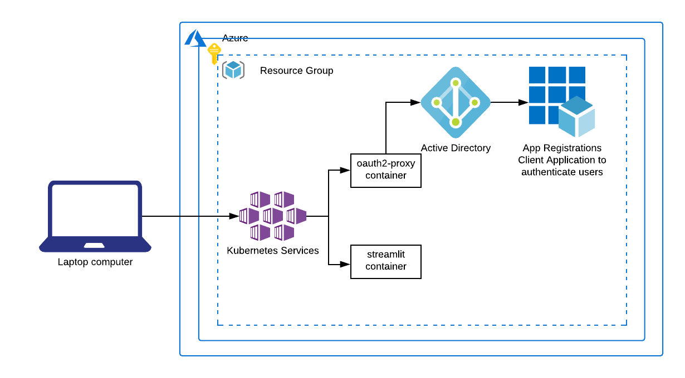

# cli-aks

Azure CLI guide to provide an example for how to deploy an Azure Kubernetes Services Streamlit application authenticated with Azure Active Directory (AAD).



## Prerequisites for guides

- Azure account
- [Azure CLI](https://docs.microsoft.com/en-us/cli/azure/get-started-with-azure-cli?view=azure-cli-latest)
- [helm](https://helm.sh/)
- [Build/Push Docker image to ACR](../app/README.md#buildingpushing-docker-image-to-azure)

## Setup

Before starting, be sure that you've followed the [instructions](../app/README.md#buildingpushing-docker-image-to-azure) for building the example Docker image and pushing to ACR.

**It is strongly recommend that you save the output of all the commands you run as there are values that will be ouput that will be needed for later commands.**

1. Deploy AKS cluster
    1. Create service principal
    1. Create AKS cluster
    1. Connect `kubectl` to AKS cluster
1. Deploy resources into cluster
    1. Create deployment and service resources for streamlit application
    1. Create nginx-ingress controller
        1. Add helm repository for nginx-ingress controller
        1. Update helm chart repository cache
        1. Install nginx-ingress helm chart
    1. Create DNS A record for IP of ingress controller
    1. Create ingress resource
    1. Navigate to site
1. Secure access to application
    1. Create cert-manager resources to manage Let's Encrypt TLS certificate
        1. Create the custom resource definitions (CRDs) for the cert-manager helm chart
        1. Disable the validation of the resources in the namespace where we deployed the resources
        1. Add helm repository for cert-manager
        1. Update helm chart repository cache
        1. Install cert-manager helm chart
        1. Create `ClusterIssuer` resource to configure TLS certificate management
        1. Update current `ingress` resource to use TLS certificate
    1. Create AAD application client
        1. Add permissions
        1. Grant permissions
        1. Create User
    1. Connect application with AAD
        1. Add authentication to the application
1. Login to newly created application

### Deploy AKS cluster

This section will deploy and configure an AKS cluster to deploy our streamlit application.

#### Create service principal
```
az ad sp create-for-rbac \
  --skip-assignment \
  --name streamlit-example-aks-cluster-service-principal
```

This will return output like this:

```
{
  "appId": "aaaaaaaa-bbbb-cccc-dddd-eeeeeeeeeeee",
  "displayName": "streamlit-example-aks-cluster-service-principal",
  "name": "http://streamlit-example-aks-cluster-service-principal",
  "password": "11111111-2222-3333-4444-555555555555",
  "tenant": "12345678-1234-1234-1234-123456789012"
}
```

#### Create AKS cluster

We will use the `appId` and the `password` to create the AKS cluster.

```
az aks create \
  --name streamlit-example-aks \
  --resource-group streamlit-example \
  --service-principal aaaaaaaa-bbbb-cccc-dddd-eeeeeeeeeeee \
  --client-secret 11111111-2222-3333-4444-555555555555 \
  --attach-acr streamlit
```

#### Connect `kubectl` to AKS cluster

With our cluster created, we need to add the AKS cluster to our `kubectl` config.

```
az aks get-credentials \
  --name streamlit-example-aks \
  --resource-group streamlit-example
```

This will return output like this:

```
Merged "streamlit-example-aks" as current context in ${HOME}/.kube/config
```

### Deploy resources into cluster

With the AKS cluster created, we can begin to deploy resources into the cluster.

#### Create deployment and service resources for streamlit application

We'll deploy our application. Start by creating a `deployment.yml` like below:

```deployment.yml
apiVersion: apps/v1
kind: Deployment
metadata:
  name: streamlit-example
  labels:
    app: streamlit
spec:
  selector:
    matchLabels:
      app: streamlit
  template:
    metadata:
      labels:
        app: streamlit
    spec:
      containers:
      - name: streamlit-app
        image: streamlit.azurecr.io/streamlit-example:1
        ports:
        - containerPort: 8501
---
apiVersion: v1
kind: Service
metadata:
  name: streamlit-example-service
  labels:
    app: streamlit
spec:
  type: ClusterIP
  selector:
    app: streamlit
  ports:
  - port: 8501
```

Now we'll create these resources by running:

```
kubectl apply -f deployment.yml
```

This will return output like this:

```
deployment.apps/streamlit-example created
service/streamlit-example-service created
```

You can validate the application is successfully deployed by running:

```
kubectl get pods
```

This will return output like this:

```
NAME                                 READY   STATUS    RESTARTS   AGE
streamlit-example-67685866c9-sxz22   1/1     Running   0          90s
```

#### Create nginx-ingress-controller

At this point the application is unreachable as we don't have an ingress controller defined to route to the application and have not publicly exposed the application with a public IP. We'll use `helm` to deploy an `nginx-ingress-controller` which will provide us the external IP that will route traffic to our application.

##### Add helm repository for nginx-ingress controller

```
helm repo add stable https://kubernetes-charts.storage.googleapis.com/
```

This will return output like this:

```
"stable" has been added to your repositories
```

##### Update helm chart repository cache

```
helm repo update
```

This will return output like this:

```
Hang tight while we grab the latest from your chart repositories...
...Successfully got an update from the "stable" chart repository
Update Complete. ⎈ Happy Helming!⎈
```

There may be other output depending on the helm repositories you have configured with your local helm cache.

##### Install nginx-ingress helm chart

```
helm install nginx-ingress stable/nginx-ingress \
    --set controller.replicaCount=2 \
    --set controller.nodeSelector."beta\.kubernetes\.io/os"=linux \
    --set defaultBackend.nodeSelector."beta\.kubernetes\.io/os"=linux
```

This will return output like this:

```
NAME: nginx-ingress
LAST DEPLOYED: Mon May 25 09:24:59 2020
NAMESPACE: default
STATUS: deployed
REVISION: 1
TEST SUITE: None
NOTES:
The nginx-ingress controller has been installed.
It may take a few minutes for the LoadBalancer IP to be available.
You can watch the status by running 'kubectl --namespace default get services -o wide -w nginx-ingress-controller'

An example Ingress that makes use of the controller:

  apiVersion: extensions/v1beta1
  kind: Ingress
  metadata:
    annotations:
      kubernetes.io/ingress.class: nginx
    name: example
    namespace: foo
  spec:
    rules:
      - host: www.example.com
        http:
          paths:
            - backend:
                serviceName: exampleService
                servicePort: 80
              path: /
    # This section is only required if TLS is to be enabled for the Ingress
    tls:
        - hosts:
            - www.example.com
          secretName: example-tls

If TLS is enabled for the Ingress, a Secret containing the certificate and key must also be provided:

  apiVersion: v1
  kind: Secret
  metadata:
    name: example-tls
    namespace: foo
  data:
    tls.crt: <base64 encoded cert>
    tls.key: <base64 encoded key>
  type: kubernetes.io/tls
```

This will output some example configurations for an ingress resource to utilize this new ingress-controller. The creation of the ingress-controller resources and provisioning of the IP might take a few minutes.

#### Create DNS A record for IP of ingress controller

With the ingress controller and public IP created, we'll query for the public IP and use that to create a DNS A record (may take a few minutes to create the IP).

```
# get IP of ingress controller
kubectl get service -l app=nginx-ingress
```

This will return output like this:

```
NAME                            TYPE           CLUSTER-IP    EXTERNAL-IP      PORT(S)                      AGE
nginx-ingress-controller        LoadBalancer   10.0.138.97   52.154.169.120   80:32112/TCP,443:31549/TCP   17m
nginx-ingress-default-backend   ClusterIP      10.0.113.64   <none>           80/TCP                       17m
```

Using the `EXTERNAL-IP` from above, create the DNS A record, in this guide we will create a record for `example.streamlit.io`.

#### Create ingress resource

To utilize the ingress-controller and be able to route traffic to our application, we'll create an ingress resource. Using the DNS record we created and the service name and port, we'll create the `ingress.yml` file to define the ingress resource.

```ingress.yml
apiVersion: extensions/v1beta1
kind: Ingress
metadata:
  name: streamlit-example-ingress
  annotations:
    kubernetes.io/ingress.class: nginx
    nginx.ingress.kubernetes.io/ssl-redirect: "false"
spec:
  rules:
  - host: example.streamlit.io
    http:
      paths:
      - backend:
          serviceName: streamlit-example-service
          servicePort: 8501
        path: /
```

Now we'll create the ingress resource by running:

```
kubectl apply -f ingress.yml
```

This will return output like this:

```
ingress.extensions/streamlit-example-ingress created
```

#### Navigate to site

Visit your application in your browser to see your application (http://example.streamlit.io in this guide). You should see your streamlit application accessible over HTTP without authentication.

### Secure access to application

Now we would like to restrict who can access the application so we'll configure a client with AAD for the application.

#### Create cert-manager resources to manage Let's Encrypt TLS certificate

We will reach for the cert-manager helm chart to configure and manage our TLS certificate. We need to:

##### Create the custom resource definitions (CRDs) for the cert-manager helm chart

```
kubectl apply \
  --validate=false \
  -f https://raw.githubusercontent.com/jetstack/cert-manager/release-0.13/deploy/manifests/00-crds.yaml
```

This will return output like this:

```
customresourcedefinition.apiextensions.k8s.io/certificaterequests.cert-manager.io created
customresourcedefinition.apiextensions.k8s.io/certificates.cert-manager.io created
customresourcedefinition.apiextensions.k8s.io/challenges.acme.cert-manager.io created
customresourcedefinition.apiextensions.k8s.io/clusterissuers.cert-manager.io created
customresourcedefinition.apiextensions.k8s.io/issuers.cert-manager.io created
customresourcedefinition.apiextensions.k8s.io/orders.acme.cert-manager.io created
```

##### Disable the validation of the resources in the namespace where we deployed the resources

```
kubectl label namespace default cert-manager.io/disable-validation=true
```

This will return output like this:

```
namespace/default labeled
```

##### Add helm repository for cert-manager

```
helm repo add jetstack https://charts.jetstack.io
```

This will return output like this:

```
"jetstack" has been added to your repositories
```

##### Update helm chart repository cache

```
helm repo update
```

This will return output like this:

```
Hang tight while we grab the latest from your chart repositories...
...Successfully got an update from the "jetstack" chart repository
...Successfully got an update from the "stable" chart repository
Update Complete. ⎈ Happy Helming!⎈
```

There may be other output depending on the helm repositories you have configured with your local helm cache.

##### Install cert-manager helm chart

```
helm install \
  cert-manager \
  --namespace default \
  --version v0.13.0 \
  jetstack/cert-manager
```

This will return output like this:

```
NAME: cert-manager
LAST DEPLOYED: Mon May 25 10:31:31 2020
NAMESPACE: default
STATUS: deployed
REVISION: 1
TEST SUITE: None
NOTES:
cert-manager has been deployed successfully!

In order to begin issuing certificates, you will need to set up a ClusterIssuer
or Issuer resource (for example, by creating a 'letsencrypt-staging' issuer).

More information on the different types of issuers and how to configure them
can be found in our documentation:

https://docs.cert-manager.io/en/latest/reference/issuers.html

For information on how to configure cert-manager to automatically provision
Certificates for Ingress resources, take a look at the `ingress-shim`
documentation:

https://docs.cert-manager.io/en/latest/reference/ingress-shim.html
```

##### Create ClusterIssuer resource to configure TLS certificate management

With the cert-manager resources deployed, we can now create our `ClusterIssuer` resource. Start by creating a `cluster-issuer.yml` file with the following:

```cluster-issuer.yml
apiVersion: cert-manager.io/v1alpha2
kind: ClusterIssuer
metadata:
  name: letsencrypt
spec:
  acme:
    server: https://acme-v02.api.letsencrypt.org/directory
    email: certificate-validation@streamlit.com
    privateKeySecretRef:
      name: letsencrypt
    solvers:
    - http01:
        ingress:
          class: nginx
```

Create the resource with the command:

```
kubectl apply -f cluster-issuer.yml
```

This will return output like this:

```
clusterissuer.cert-manager.io/letsencrypt created
```

##### Update current ingress resource to use TLS certificate

Then we'll update our ingress resource to utilize this certificate so that we're connecting via HTTPS.

```
kubectl apply -f ingress-with-tls-certificate.yml
```

This will return output like this:

```
ingress.extensions/streamlit-example-ingress configured
```

We can validate the certificate is issued by running:

```
kubectl get certificate
```

This will return output like this:

```
NAME         READY   SECRET       AGE
tls-secret   True    tls-secret   16m
```

Once `READY` has `True`, the certificate is validated with Let's Encrypt. Until that point, it is issued but has not been validated.

Navigate to your application again (https://example.streamlit.io for this guide). You will now connect over HTTPS.

#### Create AAD application client

We will need to create an AAD instance to use for authenticating the users. Generate a password to use for the `<app-secret>` and save this in a secure place.

```
az ad app create \
  --display-name <app-name> \
  --password <app-secret> \
  --reply-urls https://example.streamlit.io/oauth2/callback \
  --query appId
```

This will return the ID of the app like this:

```
ecbacb08-df8b-450d-82b3-3fced03f2b27
```

##### Add permissions

We need to add permissions

- The `--id` is the ID that was returned above
- The "magical" `--api` ID is `00000003-0000-0000-c000-000000000000` which corresponds to [`https://graph.microsoft.com/`](https://github.com/Azure/azure-cli/issues/7925#issuecomment-511543237)
- The "magical" `--api-permissions 37f7f235-527c-4136-accd-4a02d197296e=Scope e1fe6dd8-ba31-4d61-89e7-88639da4683d=Scope` are the IDs of the two permissions we want our application to have

```
az ad app permission add \
  --id ecbacb08-df8b-450d-82b3-3fced03f2b27 \
  --api 00000003-0000-0000-c000-000000000000 \
  --api-permissions 37f7f235-527c-4136-accd-4a02d197296e=Scope e1fe6dd8-ba31-4d61-89e7-88639da4683d=Scope
```

This will return output like this:

```
Invoking "az ad app permission grant --id ecbacb08-df8b-450d-82b3-3fced03f2b27 --api 00000003-0000-0000-c000-000000000000" is needed to make the change effective
```

##### Grant permissions

Adding the permissions then allows us to grant the permissions to the app client.

```
az ad app permission grant \
  --id ecbacb08-df8b-450d-82b3-3fced03f2b27 \
  --api 00000003-0000-0000-c000-000000000000
```

This may fail as it may already be applied.

##### Create User

Create the first user with access to the application:

```
az ad user create \
  --display-name <username> \
  --password Password1! \
  --user-principal-name <user>@<verified-domain-of-tenant> \
  --force-change-password-next-login true
```

#### Connect application with AAD

In order to update the application authentication to use AAD, we will need the following values:

- AAD Client ID (the value that was returned when creating the AAD)
- AAD Client secret (the value you used for the password)

##### Add authentication to the application

Connect the application with AAD with the [oauth2-proxy](https://github.com/oauth2-proxy/oauth2-proxy#installation) application. We'll start by creating the deployment and service resources for that application in the `authentication-deployment.yml` file.

Replace the following environment variables with your configuration:

- OAUTH2_PROXY_CLIENT_ID
- OAUTH2_PROXY_CLIENT_SECRET
- OAUTH2_PROXY_COOKIE_SECRET (can be created with `python -c 'import os,base64; print(base64.urlsafe_b64encode(os.urandom(16)).decode())'`)
- OAUTH2_PROXY_COOKIE_DOMAIN

```authentication-deployment.yml
apiVersion: apps/v1
kind: Deployment
metadata:
  name: oauth2-proxy
  labels:
    app: oauth2-proxy
spec:
  selector:
    matchLabels:
      app: oauth2-proxy
  template:
    metadata:
      labels:
        app: oauth2-proxy
    spec:
      containers:
      - name: oauth2-proxy
        image: quay.io/oauth2-proxy/oauth2-proxy:latest
        env:
        - name: OAUTH2_PROXY_PROVIDER
          value: "azure"
        - name: OAUTH2_PROXY_CLIENT_ID
          value: "ecbacb08-df8b-450d-82b3-3fced03f2b27"
        - name: OAUTH2_PROXY_CLIENT_SECRET
          value: "<app-secret>"
        - name: OAUTH2_PROXY_COOKIE_SECRET
          value: "uv4W-_6d6uT9Dc_4z5Ejzg=="
        - name: OAUTH2_PROXY_COOKIE_SECURE
          value: "true"
        - name: OAUTH2_PROXY_COOKIE_DOMAIN
          value: "example.streamlit.io"
        - name: OAUTH2_PROXY_EMAIL_DOMAINS
          value: "*"
        - name: OAUTH2_PROXY_UPSTREAM
          value: "http://streamlit-example-service:8501"
        - name: OAUTH2_PROXY_HTTP_ADDRESS
          value: "0.0.0.0:4180"
        ports:
        - containerPort: 4180
---
apiVersion: v1
kind: Service
metadata:
  name: oauth2-proxy-service
  labels:
    app: oauth2-proxy
spec:
  type: ClusterIP
  selector:
    app: oauth2-proxy
  ports:
  - port: 4180
```

Apply the above resources with the command:

```
kubectl apply -f authentication-deployment.yml
```

This will return output like this:

```
deployment.apps/oauth2-proxy created
service/oauth2-proxy-service created
```

Then we'll need to adjust our ingress to take advantage of the newly created `oauth2-proxy-service`. We'll create a `ingress-with-auth.yml` and create two `ingress` resources.

```ingress-with-auth.yml
apiVersion: extensions/v1beta1
kind: Ingress
metadata:
  name: streamlit-example-ingress
  annotations:
    kubernetes.io/ingress.class: nginx
    nginx.ingress.kubernetes.io/auth-url: "https://$host/oauth2/auth"
    nginx.ingress.kubernetes.io/auth-signin: "https://$host/oauth2/start?rd=$escaped_request_uri"
    cert-manager.io/cluster-issuer: letsencrypt
spec:
  tls:
  - hosts:
    - example.streamlit.io
    secretName: tls-secret
  rules:
  - host: example.streamlit.io
    http:
      paths:
      - backend:
          serviceName: streamlit-example-service
          servicePort: 8501
        path: /
---
apiVersion: extensions/v1beta1
kind: Ingress
metadata:
  name: oauth2-proxy-ingress
  annotations:
    kubernetes.io/ingress.class: nginx
    cert-manager.io/cluster-issuer: letsencrypt
spec:
  tls:
  - hosts:
    - example.streamlit.io
    secretName: tls-secret
  rules:
  - host: example.streamlit.io
    http:
      paths:
      - backend:
          serviceName: oauth2-proxy-service
          servicePort: 4180
        path: /oauth2
```

Run the command:

```
kubectl apply -f ingress-with-auth.yml
```

This will return output like this:

```
ingress.extensions/streamlit-example-ingress configured
ingress.extensions/oauth2-proxy-ingress created
```

### Login to newly created application

Check your newly deployed application (https://example.streamlit.io for this guide).

You will be prompted to login. Login with the user that we created earlier.

## Troubleshooting

While deploying this, if you get redirected back to the application with error about `csrf`, clear the browser cookies and try again. This is a known issue that you can encounter with the `oauth2-proxy`.

https://github.com/oauth2-proxy/oauth2-proxy/issues/404
