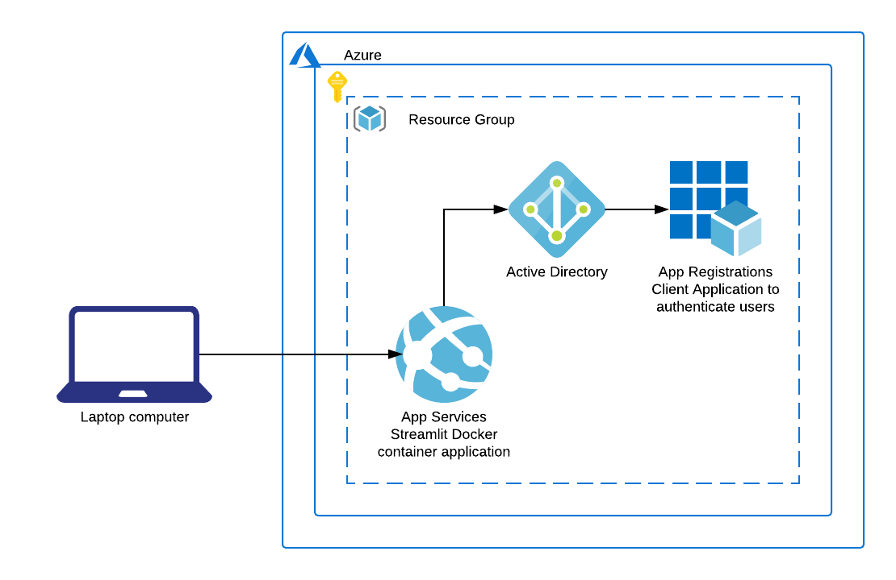

# cli-app-services

Azure CLI guide to provide an example for how to deploy an Azure App Services Streamlit application authenticated with Azure Active Directory (AAD).



## Prerequisites for guides

- Azure account
- [Azure CLI](https://docs.microsoft.com/en-us/cli/azure/get-started-with-azure-cli?view=azure-cli-latest)
- [Build/Push Docker image to ACR](../app/README.md#buildingpushing-docker-image-to-azure)

## Setup

Before starting, be sure that you've followed the [instructions](../app/README.md#buildingpushing-docker-image-to-azure) for building the example Docker image and pushing to ACR.

**It is strongly recommend that you save the output of all the commands you run as there are values that will be ouput that will be needed for later commands.**

1. Deploy App Services Docker application
    1. Create App Service Plan
    1. Create Web App in service plan
    1. Configure port for application
    1. Configure application to only allow HTTPS
    1. Navigate to site
1. Secure access to application
    1. Create AAD application client
        1. Add permissions
        1. Grant permissions
    1. Connect application with AAD
        1. Get Active Directory URL
        1. Add authentication to the application
    1. Create User
1. Login to newly created application

### Deploy App Services Docker application

We will be building/deploying an App Services Docker application.

#### Create App Service Plan

To create an App Services application, we first need to create a App Service Plan with the desired size.

```
az appservice plan create \
  --name streamlit-example \
  --resource-group streamlit-example \
  --is-linux
```

#### Create Web App in service plan

Next we'll create ande deploy a Docker Web App in the service plan. You will need to choose a globally unique name as the `name` of the application is used as a subdomain of  `azurewebsites.net` for the deployed application and will be used throughout the rest of the guide.

```
az webapp create \
  --name <app-name> \
  --plan streamlit-example \
  --resource-group streamlit-example \
  --deployment-container-image-name streamlit.azurecr.io/streamlit-example:1
```

This will deploy your application to `https://<app-example>.azurewebsites.net` but will not be accessible yet as we need to specify the port for the application to use.

#### Configure port for application

We have to tell the Web App what port our container is running on with the `WEBSITES_PORT` environment variable. Update the settings with the following command:

```
az webapp config appsettings set \
  --name <app-name> \
  --resource-group streamlit-example \
  --settings WEBSITES_PORT=8501
```

The application is now accessible via `https://<app-example>.azurewebsites.net`. It is not restricted yet to only HTTPS.

#### Configure application to only allow HTTPS

In order to only allow HTTPS connections and redirect HTTP to HTTPS, run the command:

```
az webapp update \
  --resource-group streamlit-example \
  --name <app-name> \
  --https-only true
```

#### Navigate to site

Validate the application is properly deployed to `https://<app-name>.azurewebsites.net`.

### Secure Access to application

Now we would like to restrict who can access the application so we'll configure a client with AAD for the application.

#### Create AAD application client

We will need to create an AAD instance to use for authenticating the users. Generate a password to use for the app secret and save this in a secure place.

```
az ad app create \
  --display-name <app-name> \
  --password <app-secret> \
  --reply-urls https://<app-name>.azurewebsites.net/.auth/login/aad/callback \
  --query appId
```

This will return the ID of the app like this:

```
ecbacb08-df8b-450d-82b3-3fced03f2b27
```

##### Add permissions

We need to add permissions

- The `--id` is the ID that was returned above
- The "magical" `--api` ID is `00000003-0000-0000-c000-000000000000` which corresponds to [`https://graph.microsoft.com/`](https://github.com/Azure/azure-cli/issues/7925#issuecomment-511543237)
- The "magical" `--api-permissions 37f7f235-527c-4136-accd-4a02d197296e=Scope e1fe6dd8-ba31-4d61-89e7-88639da4683d=Scope` are the IDs of the two permissions we want our application to have

```
az ad app permission add \
  --id ecbacb08-df8b-450d-82b3-3fced03f2b27 \
  --api 00000003-0000-0000-c000-000000000000 \
  --api-permissions 37f7f235-527c-4136-accd-4a02d197296e=Scope e1fe6dd8-ba31-4d61-89e7-88639da4683d=Scope
```

This will return output like this:

```
Invoking "az ad app permission grant --id ecbacb08-df8b-450d-82b3-3fced03f2b27 --api 00000003-0000-0000-c000-000000000000" is needed to make the change effective
```

##### Grant permissions

Adding the permissions then allows us to grant the permissions to the app client.

```
az ad app permission grant \
  --id ecbacb08-df8b-450d-82b3-3fced03f2b27 \
  --api 00000003-0000-0000-c000-000000000000
```

#### Connect application with AAD

In order to update the application authentication to use AAD, we will need the following values:

- AAD Client ID (the value that was returned when creating the AAD)
- AAD Client secret (the value you used for the password)
- AAD Token Issuer URL (combination of values)

##### Get Active Directory URL

```
az cloud show --query endpoints.activeDirectory
```

This will return output like this:

```
"https://login.microsoftonline.com"
```

Then get your Tenant ID:

```
az account show --query tenantId
```

This will return output like this:

```
"54826b22-38d6-4fb2-bad9-b7983a3e9c5a"
```

Use both of the above outputs to create the `aad-token-issuer-url` when adding auth to the application.

```
https://login.microsoftonline.com/54826b22-38d6-4fb2-bad9-b7983a3e9c5a/
```

##### Add authentication to the application

Connect the application with AAD substituting the values accordingly:

```
az webapp auth update \
  --resource-group streamlit-example \
  --name <app-name> \
  --enabled true \
  --action LoginWithAzureActiveDirectory \
  --aad-allowed-token-audiences https://<app-name>.azurewebsites.net/.auth/login/aad/callback \
  --aad-client-id ecbacb08-df8b-450d-82b3-3fced03f2b27 \
  --aad-client-secret <app-secret> \
  --aad-token-issuer-url https://login.microsoftonline.com/54826b22-38d6-4fb2-bad9-b7983a3e9c5a/
```

Navigate to yoru application again (`https://<app-name>.azurewebsites.net`). You will be prompted to login to access the application (it may take a minute for the application to redirect the user to authenticate).

#### Create User

Create the first user with access to the application:

```
az ad user create \
  --display-name <username> \
  --password Password1! \
  --user-principal-name <user>@<verified-domain-of-tenant> \
  --force-change-password-next-login true
```

### Login to newly created application

Check your newly deployed application `https://<app-name>.azurewebsites.net`.

You will be prompted to login. Login with the username that we just created.
